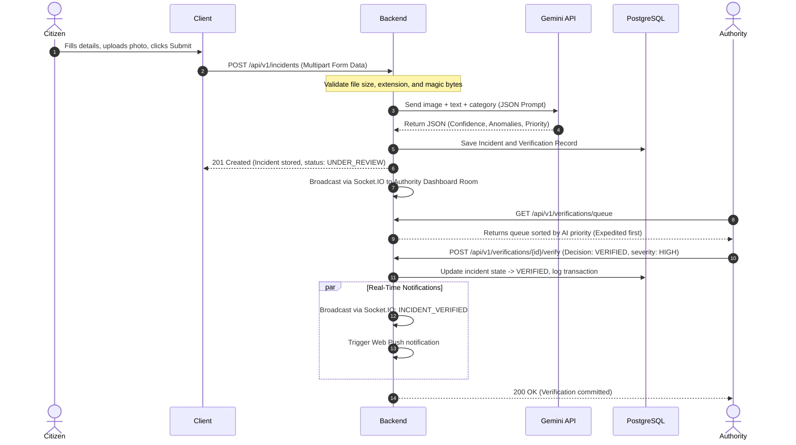

# Architecture

> Architectural documentation for the Disaster Response Platform.

---

## 1. System Overview
The Disaster Response Platform is an AI-assisted web application designed to collect disaster incident reports from citizens, validate them using automated multimodal checks, organize human reviews, coordinate shelter routing, and disseminate real-time geofenced alert warnings.

---

## 2. Architectural Style
* **[Confirmed Requirement]** The system will be built as a **Modular Monolith** to keep infrastructure overhead low while maintaining clear logical boundaries for future service extraction.
* **[Confirmed Requirement]** All core business logic must reside within service layers rather than controller route handlers.
* **[Confirmed Requirement]** Third-party systems—such as the Gemini API, Mapbox, and S3-compatible object storage—must be isolated behind dedicated service boundary layers.
* **[Engineering Decision]** Inter-module communication will utilize typed interface calls and internal event dispatchers. Directly querying other modules' database tables is prohibited.

---

## 3. Frontend Architecture
* **[Confirmed Requirement]** React 18+ with TypeScript, Vite, Tailwind CSS, React Router, and TanStack Query.
* **[Engineering Decision]** Folder layout separates global components, features modules, custom context providers, hooks, and client wrappers:
  * `/src/components`: Generic stateless UI elements.
  * `/src/context`: Auth and Socket.IO connection contexts.
  * `/src/features`: Domain-driven code (incidents, verifications, shelters).
  * `/src/hooks`: Custom hooks (e.g. `useGeolocation`, `useMap`).
  * `/src/api`: Axios wrappers.

---

## 4. Backend Modular Monolith Architecture
* **[Confirmed Requirement]** Node.js, Express.js, and TypeScript.
* **[Confirmed Requirement]** The codebase must isolate logic into separate backend modules:

```
[ Express Routing Middleware ]
               │
               ▼
┌────────────────────────────────────────────────────────────────────────┐
│                        BACKEND MODULE BOUNDARIES                       │
│ ┌──────────────┐ ┌──────────────┐ ┌──────────────┐ ┌─────────────────┐ │
│ │     Auth     │ │  Incidents   │ │ Human Review │ │     Shelters    │ │
│ └──────────────┘ └──────────────┘ └──────────────┘ └─────────────────┘ │
│ ┌──────────────┐ ┌──────────────┐ ┌──────────────┐ ┌─────────────────┐ │
│ │  AI Engine   │ │    Alerts    │ │  Resources   │ │   Audit Logs    │ │
│ └──────────────┘ └──────────────┘ └──────────────┘ └─────────────────┘ │
└────────────────────────────────────────────────────────────────────────┘
               │
               ▼
[ Backend Services ] ──> [ Data Access Layer ] ──> [ PostgreSQL + PostGIS ]
```

---

## 5. Request and Data Flow


---

## 6. Authentication & Session Flow
* **[Confirmed Requirement]** Access tokens are short-lived (15 minutes). Refresh tokens are long-lived (7 days).
* **[Confirmed Requirement]** Both access and refresh tokens use secure `HttpOnly` cookies (with `Secure` flag active in production and `SameSite=Strict` configured). Storing long-lived tokens in client `localStorage` is prohibited.
* **[Confirmed Requirement]** Refresh tokens must use token rotation (generating a new refresh token on token refresh, while invalidating the old one).
* **[Confirmed Requirement]** Only a secure hashed representation of the refresh token/session is stored in the database. Raw refresh tokens must never be stored in the database.
* **[Confirmed Requirement]** The backend must support server-side session revocation.
* **[Engineering Decision]** The database contains session metadata for tracking: `user_id`, `token_hash` (SHA-256), `issued_at`, `expires_at`, `revoked_at`, and `optional controlled client device/session metadata`.

---

## 7. Role-Based Access Control (RBAC)
* **[Confirmed Requirement]** Permission checks must be enforced server-side.
* **[Confirmed Requirement]** Roles are: `CITIZEN`, `VOLUNTEER`, `NGO`, `AUTHORITY`, `ADMIN`.
* **[Confirmed Requirement]** Location coordinates visibility is role-based:
  * *Public/Citizen:* Accesses rounded/approximate coordinates only.
  * *Volunteer:* Accesses exact coordinates only for reports assigned/eligible for active review.
  * *NGO:* Accesses exact coordinates only within authorized operational zones.
  * *Authority/Admin:* Full access to exact coordinates.

---

## 8. Core Workflows
### 8.1 Incident Lifecycle
* **[Confirmed Requirement]** Incidents follow this lifecycle:
  $$\text{SUBMITTED} \longrightarrow \text{UNDER\_REVIEW} \longrightarrow \text{VERIFIED} \text{ or } \text{REJECTED}$$
* **[Confirmed Requirement]** Incident status transitions operate as follows:
  1. The incident is initially persisted as `SUBMITTED`.
  2. After submission processing begins, it enters `UNDER_REVIEW`. The citizen submission endpoint may return `201 Created` while the incident is transitioning into `UNDER_REVIEW`.
  3. Gemini availability does not determine whether human review occurs. If Gemini is unavailable, the incident still enters `UNDER_REVIEW` and receives `AI_UNAVAILABLE` priority in the human review queue, and human review remains available.
  4. The Authority makes the final `VERIFIED` or `REJECTED` decision. No other incident states exist.
* **[Confirmed Requirement]** Unverified reports must never trigger public alerts or display on public maps.

### 8.2 AI Verification Flow
* **[Confirmed Requirement]** Serves as Stage 1 check. Evaluates description, category, and photo for consistency.
* **[Confirmed Requirement]** Returns structured JSON containing: `confidenceScore` (0.00 to 1.00), `consistencyResult` (boolean), `detectedAnomalies` (array), `explanation` (text), `verificationPriority` (`LOW`, `NORMAL`, `EXPEDITED`), and `advisorySeverity` (`LOW`, `MEDIUM`, `HIGH`, `CRITICAL`).
* **[Confirmed Requirement]** The AI-generated `advisorySeverity` is advisory only and is NOT the authoritative incident severity. The final verification decision and authoritative incident severity are controlled exclusively by the human Authority. AI `advisorySeverity` must never automatically become the authoritative incident severity.
* **[Confirmed Requirement]** AI consistency checks are advisory and must not block human queues. If the Gemini API fails, priority defaults to `AI_UNAVAILABLE`.

### 8.3 Human Verification Flow
* **[Confirmed Requirement]** Multiple human reviews can exist for one incident.
* **[Confirmed Requirement]** Volunteer and NGO reviews are recommendations (Stage 2).
* **[Confirmed Requirement]** The Authority makes the final verification decision (Stage 3).
* **[Confirmed Requirement]** The final decision updates the authoritative incident lifecycle (`SUBMITTED` -> `UNDER_REVIEW` -> `VERIFIED` or `REJECTED`).
* **[Confirmed Requirement]** The verification/review ID must not be confused with the incident ID (they correspond to separate entities in the database).

### 8.4 Shelter Registry and Routing Flow
* **[Confirmed Requirement]** Registry tracks capacities. Discoveries query active shelters using PostGIS proximity checks.
* **[Confirmed Requirement]** The system provides Mapbox visual route overlays to the nearest shelter. Reservations and bookings are excluded from the MVP.

### 8.5 Resource Coordination Flow
* **[Confirmed Requirement]** Supplies (resources) can be allocated to multiple targets (incidents, shelters, organizations).
* **[Engineering Decision]** Tracked via a `resource_allocations` table linking allocations to unique target identifiers.

### 8.6 Notification Flow
* **[Confirmed Requirement]** Employs Socket.IO for active client warning banners and Web Push/FCM for background delivery.

---

## 9. Real-Time Socket.IO Architecture
* **[Confirmed Requirement]** Real-time warning alert transmissions are triggered via Socket.IO.
* **[Engineering Decision]** Sockets are segregated into namespaces (`/live/citizens` and `/live/dispatchers`). Active clients are grouped into location-based socket rooms using coordinate rounding parameters to reduce load. Normal REST APIs remain available if real-time delivery is unavailable; no HTTP polling fallback is used.

---

## 10. Geospatial PostGIS & Mapbox Architecture
* **[Confirmed Requirement]** PostGIS handles coordinate storage, spatial queries, and geographic indexes. Mapbox handles frontend map rendering and route visual lines.
* **[Confirmed Requirement]** The AI does not calculate or verify geographic metrics.
* **[Engineering Decision]** Spatial records use SRID 4326. Indexing utilizes PostgreSQL GiST indices. Radius queries cast geometries to `geography` types for accurate calculations in meters.

---

## 11. S3/MinIO Storage Flow
* **[Confirmed Requirement]** File storage is S3-compatible. The MVP enforces a backend-mediated upload flow where all media is streamed to the backend server first for validation (size, MIME type, extension, and magic-byte checks) before upload to S3/MinIO:
  $$\text{Client} \longrightarrow \text{Backend (Validation)} \longrightarrow \text{S3/MinIO Storage}$$
  Pre-signed direct client-to-S3 uploads are out of MVP and may only be mentioned as a possible future optimization.

---

## 12. Docker Development Architecture
* **[Confirmed Requirement]** Docker Compose will spin up local PostgreSQL + PostGIS and MinIO emulators.
* **[Confirmed Requirement]** Running components natively on the host machine using standard Node commands (e.g. `npm run dev`) must remain possible.

---

## 13. API Module Structure
```
/api/v1/auth          -> Login, register, logout, session refresh
/api/v1/incidents     -> Submit incidents, list sanitized verified reports
/api/v1/verifications -> Fetch queues, log recommendations, commit final verifies
/api/v1/shelters      -> Proximity query, available capacity updates
/api/v1/alerts        -> Post targeted warnings
/api/v1/resources     -> Inventory registrations and allocations
/api/v1/audit         -> Administrative logs (Admin/Authority only)
```

---

## 14. Technology Decisions
* **[Confirmed Requirement]** PostgreSQL + PostGIS is the primary database. MongoDB is prohibited.
* **[Confirmed Requirement]** AI model is Google Gemini (`gemini-2.5-flash` initial model).
* **[Confirmed Requirement]** Map provider is Mapbox.

---

## 15. Important Architectural Constraints
* **[Confirmed Requirement]** S3 credentials and Gemini API keys must never be exposed to the client browser.
* **[Confirmed Requirement]** Experimental research paper accuracy numbers must not be hardcoded or used as static thresholds.
* **[Confirmed Requirement]** Database schemas must isolate AI outputs from human review logging.

---

## 16. Pre-Implementation Open Questions
* **[Open Question 1]** NGO Scope: What mechanism will define and enforce the geographic/operational review limits for NGO accounts?
* **[Open Question 2]** Warning TTL: What is the standard duration before warning alerts expire?
* **[Open Question 3]** Notification Log Retention: How long are warning history notification rows preserved before cleanup?
* **[Open Question 4]** Location Prompt UX: How should coordinates retrieval confirmation be requested on the frontend?
* **[Open Question 5]** Rate Limiting Configs: What are the exact request limits permitted per user role?
* **[Open Question 6]** Static Roles vs Custom Permissions: Should role settings remain static, or must the database support configurable role permissions?
