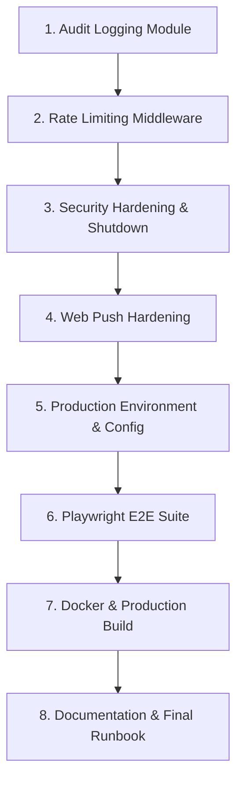

# Phase 5 — Final Implementation Contract

**Document Version:** 2.0.0  
**Date:** 2026-09-25  
**Contract Status:** APPROVED — FROZEN — IMPLEMENTATION NOT STARTED  
**Prerequisite:** Phase 1, Phase 2, Phase 3, and Phase 4 FROZEN  

---

## 1. Contract Status

This document defines the final, immutable specification and architectural contract for **Phase 5: Hardening, Administrative Audit Trail, and Deployment Readiness**.

* **Approval Status:** **APPROVED AND FROZEN.** All 9 architectural decisions have been officially reviewed, resolved, and approved.
* **Implementation State:** **STRICTLY NOT STARTED.** No code, configuration, database schema, or dependencies have been modified.
* **Frozen Baseline:** Phases 1–4 are officially frozen and verified via smoke test. Their current implementation represents the source of truth and must not be refactored, redesigned, or broken during Phase 5.
* **Contract Phase State:** **APPROVED — FROZEN — IMPLEMENTATION NOT STARTED.** This contract is now frozen and forms the immutable specification for Phase 5 implementation. Phase 5 implementation may begin only according to this frozen contract.

---

## 2. Source-of-Truth Hierarchy

All technical specifications, boundaries, and trade-offs in this contract are governed by the following strict hierarchy of authority:

1. **Actual Frozen Phase 1–4 Implementation Code** (Active source code in `/backend` and `/frontend`).
2. **Frozen Phase 1–4 Decisions & Freeze Records** (`phase4_freeze_record.md`, `phase1-4_smoke_test_report.md`).
3. **Existing Architectural & Security Documentation** (`/Docs/architecture.md`, `/Docs/security.md`, `/Docs/database.md`, `/Docs/phases.md`).
4. **Phase 5 Discovery & Current-State Audit** (`/Docs/phase5_discovery_audit.md`).
5. **This Contract Document** (`/Docs/phase5_final_contract.md`).

*Rule on Discrepancies:* If any discovery finding or contract clause conflicts with the frozen Phase 1–4 implementation code, the frozen implementation code takes precedence, and the discrepancy must be formally documented rather than silently changing running code.

---

## 3. Phase 5 Objective

The singular objective of Phase 5 is to transition the verified, working Disaster Response Coordination Hub (DRCH) MVP from a development-frozen state into a hardened, production-ready, auditable, and deployable release without introducing new business features, new database paradigms, or altering frozen contracts.

### Scope Pillars:
1. **Administrative Audit Trail:** Implement an append-only and access-controlled, queryable audit logging trail for critical administrative and disaster lifecycle events. Cryptographic tamper-evidence (hash chains, digital signatures, WORM storage) is strictly **OUT OF SCOPE** for Phase 5.
2. **Security Hardening:** Tighten Socket.IO CORS, enforce production secret hygiene, eliminate stack trace leakage, establish graceful shutdown, and handle unmatched routes cleanly with JSON 404 responses.
3. **Controlled Rate Limiting:** Enforce single-process in-memory request throttling across auth, incident reporting, and public read routes without throttling internal authenticated operators.
4. **Web Push Production Hardening:** Validate VAPID configurations, sanitize push subscriptions, and define browser delivery boundaries while preserving frozen Phase 4 TTL and spatial algorithms.
5. **Playwright E2E Test Suite:** Establish end-to-end automated testing for 11 critical user journeys across all system roles.
6. **Production Build & Deployment Readiness:** Provide containerization artifacts (deployment-target dependent), environment checklists, backup/restore procedures, and operational runbooks.
7. **Performance & Security Validation:** Execute focused load and security sanity checks on key endpoints.

---

## 4. Current-State Baseline & Discrepancy Verification

### 4.1 Database Table Count Verification
* **Discovery Finding:** The discovery report noted 16 tables.
* **Actual Application Code Verification (`backend/src/db/init.ts`):** Exactly **15 application tables** are defined in `init.ts`:
  1. `users` (Phase 1)
  2. `roles` (Phase 1)
  3. `user_roles` (Phase 1)
  4. `sessions` (Phase 1)
  5. `incidents` (Phase 2)
  6. `incident_media` (Phase 2)
  7. `ai_verifications` (Phase 2)
  8. `organizations` (Phase 3)
  9. `human_reviews` (Phase 3)
  10. `shelters` (Phase 3)
  11. `resources` (Phase 4)
  12. `resource_allocations` (Phase 4)
  13. `alerts` (Phase 4)
  14. `notifications` (Phase 4)
  15. `push_subscriptions` (Phase 4)
* **Discrepancy Resolution:**
  - In `database.md` §2.16, `audit_logs` was listed conceptually as the 16th table, but was deferred from `init.ts` until Phase 5.
  - In the physical PostgreSQL instance, the PostGIS extension creates `spatial_ref_sys`, which constitutes a 16th table in the `public` schema.
  - **Contract Definition:** There are exactly 15 active application tables. `audit_logs` will be added as the 16th application table in Phase 5.

### 4.2 Module and Test Baseline
* **Backend Modules:** 8 active modules (`auth`, `incidents`, `ai`, `verifications`, `shelters`, `alerts`, `resources`, `notifications`).
* **Middleware:** 5 active middlewares (`authenticate`, `authorize`, `errorHandler`, `requestIdMiddleware`, `upload`).
* **Test Suite Status:** 22/22 backend unit/integration tests passing (Vitest); 14/14 frontend tests passing.
* **Known Limitation:** The test-runner mismatch documented in `phase1-4_smoke_test_report.md` (Phase 1–3 backend test files written with Jest assertions while runner is Vitest) remains tracked and is not silently masked.
* **Infrastructure Baseline:** Single PostgreSQL 15 + PostGIS 3.3 container, MinIO S3 object storage container, Express backend, React 19 + Vite frontend.

---

## 5. Audit Logging Contract

### 5.1 Minimum Database Schema
Phase 5 introduces the `audit_logs` table using the existing database initialization pattern (`CREATE TABLE IF NOT EXISTS`):

```sql
CREATE TABLE IF NOT EXISTS audit_logs (
  id UUID PRIMARY KEY,
  action VARCHAR(100) NOT NULL,
  actor_id UUID REFERENCES users(id) ON DELETE SET NULL,
  target_type VARCHAR(50) NOT NULL,
  target_id UUID NOT NULL,
  metadata JSONB,
  ip_address INET,
  created_at TIMESTAMPTZ NOT NULL DEFAULT CURRENT_TIMESTAMP
);

CREATE INDEX IF NOT EXISTS idx_audit_logs_actor ON audit_logs (actor_id);
CREATE INDEX IF NOT EXISTS idx_audit_logs_target ON audit_logs (target_type, target_id);
CREATE INDEX IF NOT EXISTS idx_audit_logs_created ON audit_logs (created_at);
```

### 5.2 Mandatory Audited Actions
The audit service must record events for the following 11 operations:

| # | Action Identifier | Triggering Event / Location | Target Type | Target ID | Metadata Recorded |
|---|-------------------|-----------------------------|-------------|-----------|-------------------|
| 1 | `USER_REGISTERED` | `auth.service.ts: registerUser` | `USER` | User ID | `{ email, displayName }` |
| 2 | `LOGIN_SUCCESS` | `auth.service.ts: loginUser` | `USER` | User ID | `{ email, userAgent }` |
| 3 | `LOGIN_FAILED` | `auth.service.ts: loginUser` | `USER` | `00000000-0000-0000-0000-000000000000` (or user ID if found) | `{ attemptedEmail, reason }` |
| 4 | `SESSION_REVOKED` | `auth.service.ts: logoutSession` | `SESSION` | Session ID | `{ userId }` |
| 5 | `INCIDENT_VERIFIED` | `verifications.service.ts: submitAuthorityVerification` | `INCIDENT` | Incident ID | `{ decision: 'VERIFIED', severity, previousStatus: 'UNDER_REVIEW' }` |
| 6 | `INCIDENT_REJECTED` | `verifications.service.ts: submitAuthorityVerification` | `INCIDENT` | Incident ID | `{ decision: 'REJECTED', previousStatus: 'UNDER_REVIEW' }` |
| 7 | `ALERT_CREATED` | `alerts.service.ts: createAlert` | `ALERT` | Alert ID | `{ incidentId, severity, title }` |
| 8 | `ALERT_CANCELLED` | `alerts.service.ts: cancelAlert` | `ALERT` | Alert ID | `{ cancellationReason }` |
| 9 | `SHELTER_CAPACITY_UPDATED` | `shelters.service.ts: updateShelterCapacity` | `SHELTER` | Shelter ID | `{ previousAvailable, newAvailable, totalCapacity }` |
| 10 | `RESOURCE_ALLOCATED` | `resources.service.ts: allocateResource` | `RESOURCE_ALLOCATION` | Allocation ID | `{ resourceId, quantity, targetType, targetId }` |
| 11 | `RESOURCE_ALLOCATION_DELETED`| `resources.service.ts: deleteAllocation` | `RESOURCE_ALLOCATION` | Allocation ID | `{ resourceId, releasedQuantity }` |

*Scope Restriction:* Role modification auditing is **deferred** because role-editing API endpoints do not exist in the frozen Phase 1–4 codebase. Adding role-editing endpoints purely for audit logs is strictly out of scope.

### 5.3 Data Strictly Prohibited from Audit Logs
Under no circumstances may any of the following secrets or credentials be serialized into `metadata` or any audit log field:
* Passwords or plain-text credentials
* Password hashes (bcrypt hashes)
* Raw JWT access tokens or refresh tokens
* Token hashes (`token_hash` from `sessions`)
* JWT secrets (`JWT_ACCESS_SECRET`, `JWT_REFRESH_SECRET`)
* VAPID private key (`VAPID_PRIVATE_KEY`)
* S3 / MinIO secret keys (`S3_SECRET_KEY`)
* Gemini API keys (`GEMINI_API_KEY`)
* Raw HTTP Authorization or Cookie headers

### 5.4 Approved Audit Write Consistency Policy (Contract Standard)
The audit write consistency behavior is formally specified as an approved contract policy and is intentionally distinguished between transactional and non-transactional operations:

1. **Transactional Critical Actions (Atomic Consistency):**
   - For operations executing within an active PostgreSQL transaction (`submitAuthorityVerification`, `createAlert`, `allocateResource`, `deleteAllocation`), the audit log insert must be executed using the active transactional `client` before `COMMIT`.
   - **Rationale:** Strict atomicity ensures that the business mutation and its audit record commit together. If the business operation rolls back, no phantom audit record is created; if the audit insert fails, the transaction rolls back, preventing un-audited state changes.
2. **Non-Transactional Actions (Best-Effort Consistency):**
   - For auth operations that execute outside multi-statement transactions (`USER_REGISTERED`, `LOGIN_SUCCESS`, `LOGIN_FAILED`, `SESSION_REVOKED`), audit records must be written immediately using the connection pool (`pool.query()`).
   - **Failure Handling:** If a non-transactional audit insert fails, it must be logged to `logger.error()` with error details, but must **not** fail the primary user authentication, registration, or logout operation.
   - **Rationale:** An isolated audit logging hiccup must not prevent legitimate disaster responders or citizens from authenticating or logging out.
3. **No Added Infrastructure:**
   - No Redis, message queues, transactional outbox tables, event buses, cryptographic audit chains, or external logging services shall be introduced.

### 5.5 Audit Log API & Access Control
* **Endpoints:**
  - `GET /api/v1/audit`: Read-only, paginated audit log query endpoint.
  - Query parameters: `page`, `limit` (max 100), `action`, `targetType`, `actorId`, `startDate`, `endDate`.
* **Access Control:** Restricted strictly to `ADMIN` and `AUTHORITY` roles via `authenticate` and `authorize('ADMIN', 'AUTHORITY')`.
* **Immutability:** No `POST`, `PUT`, `PATCH`, or `DELETE` endpoints shall exist. Audit logs are strictly append-only.
* **Response Safety:** Responses must never expose internal secrets, sensitive tokens, or raw authentication metadata.

---

## 6. Security Hardening Contract

### 6.1 Helmet Configuration
* Retain `app.use(helmet())` as the primary middleware in `app.ts`.
* In production (`NODE_ENV === 'production'`), verify standard security headers:
  - `Content-Security-Policy`
  - `X-Content-Type-Options: nosniff`
  - `X-Frame-Options: SAMEORIGIN` / `DENY`
  - `Strict-Transport-Security` (HSTS with 1-year max-age)
  - `Referrer-Policy: no-referrer-when-downgrade`

### 6.2 Production CORS Configuration
* **HTTP API CORS:**
  - `origin`: Strict match against `env.FRONTEND_URL`. Reject wildcard `*` or unspecified origins when credentials are included.
  - `credentials: true`.
  - Methods: `GET, POST, PUT, PATCH, DELETE, OPTIONS`.
  - Allowed Headers: `Content-Type, Authorization, X-Request-ID`.
* **Socket.IO CORS Hardening:**
  - In `socket.server.ts:31`, current code uses `origin: true` (reflecting any origin).
  - **Contract Requirement:** Must be restricted in production to `env.FRONTEND_URL`:
    ```typescript
    cors: {
      origin: env.NODE_ENV === 'production' ? env.FRONTEND_URL : true,
      credentials: true,
    }
    ```

### 6.3 Cookie Security Policy
* Retain existing token cookie configurations from `tokens.ts`:
  - `httpOnly: true` (prevents JavaScript access)
  - `sameSite: 'strict'` (defends against cross-site request forgery)
  - `secure: env.NODE_ENV === 'production'` (enforces HTTPS delivery in production)
  - `domain`: Bound to `env.COOKIE_DOMAIN` when configured.

### 6.4 Refresh Token & Session Security
* Continue storing only SHA-256 hashes of refresh tokens (`token_hash`) in `sessions`.
* Retain token rotation semantics: upon `/api/v1/auth/refresh`, revoke old session and issue new access/refresh pair.
* Retain revocation checks on all refresh attempts (`revoked_at IS NULL AND expires_at > NOW()`).

### 6.5 Production Error Handling & 404 Catch-All
* **Centralized Error Handler (`errorHandler.ts`):**
  - In production (`NODE_ENV === 'production'`), `details` and stack traces must never be sent to the client.
  - Default message for unhandled errors: `"An internal server error occurred."`
* **JSON 404 Catch-All:**
  - Unmatched routes currently return Express's default HTML 404.
  - Contract requires an explicit catch-all route handler mounted before `errorHandler`:
    ```json
    {
      "ok": false,
      "error": {
        "code": "NOT_FOUND",
        "message": "The requested API endpoint does not exist.",
        "details": []
      }
    }
    ```

### 6.6 Environment & Secret Hygiene
* Validate all environment variables at startup using Zod in `config/env.ts`.
* In production (`NODE_ENV === 'production'`):
  - `JWT_ACCESS_SECRET` and `JWT_REFRESH_SECRET` must be distinct, random, and at least 64 characters in length.
  - Development fallback secrets (e.g. `'dev_access_secret_...'`) must fail startup validation immediately.
  - Default S3 credentials (`minioadmin`, `change_me_locally`) must fail startup validation.
  - `GEMINI_API_KEY` must remain strictly backend-only.

### 6.7 Graceful Process Shutdown
* The process entry point (`index.ts`) must handle `SIGTERM` and `SIGINT` signals:
  1. Stop accepting new HTTP connections via `server.close()`.
  2. Disconnect Socket.IO server (`io.close()`).
  3. Drain and close the PostgreSQL pool (`pool.end()`).
  4. Force process termination after a 10-second timeout if connections fail to drain.

### 6.8 Expired Session Cleanup
* **Technical Query Standard:** Provide a safe, parameterized database maintenance query to purge sessions where `expires_at < NOW() - INTERVAL '30 days'` or `revoked_at < NOW() - INTERVAL '30 days'`.
* **Approved Execution Mechanism:** Scheduled cleanup script / cron-based mechanism executing the purge query. No Redis, message queues, background worker services, or external schedulers shall be introduced.

---

## 7. Rate Limiting Contract

### 7.1 Architecture & Engine
* Rate limiting shall be implemented using the industry-standard `express-rate-limit` package.
* **Store:** Single-process in-memory store (`MemoryStore`).
* **External Stores:** Redis, Memcached, and external databases are **strictly OUT OF SCOPE**.

### 7.2 Rate Limit Groups & Specifications

| Group Name | Protected Routes & Methods | Rate Limit Window | Max Requests | Keying Strategy | Error Response Code |
|------------|----------------------------|-------------------|--------------|-----------------|---------------------|
| `authLimiter` | `POST /api/v1/auth/login`<br>`POST /api/v1/auth/register` | 15 minutes | 5 requests | Client IP (`req.ip`) | 429 (`RATE_LIMITED`) |
| `incidentSubmissionLimiter` | `POST /api/v1/incidents` | 15 minutes | 10 requests | Authenticated User ID (`req.user.id`) | 429 (`RATE_LIMITED`) |
| `refreshLimiter` | `POST /api/v1/auth/refresh` | 15 minutes | 10 requests | Client IP (`req.ip`) | 429 (`RATE_LIMITED`) |
| `generalPublicLimiter` | `GET /api/v1/incidents/public`<br>`GET /api/v1/shelters`<br>`GET /api/v1/alerts` | 15 minutes | 100 requests | Client IP (`req.ip`) | 429 (`RATE_LIMITED`) |

### 7.3 Middleware Ordering & Placement Rules
1. **Anonymous / Auth Routes:** `authLimiter` and `refreshLimiter` run at the router level before request handlers.
2. **Authenticated Incident Submission:**
   - **Crucial Order:** `router.post('/', authenticate, incidentSubmissionLimiter, upload.array('media', 3), createIncidentHandler)`
   - `incidentSubmissionLimiter` **MUST** run *after* `authenticate` so `req.user.id` is populated.
   - `incidentSubmissionLimiter` **MUST** run *before* `upload.array('media')` to reject rate-limited users *before* uploading multi-megabyte files into memory or disk.
3. **General Public Read Routes:** Must be targeted exclusively to explicitly defined public read endpoints (`GET /api/v1/incidents/public`, `GET /api/v1/shelters`, `GET /api/v1/alerts`). It must **never** be mounted globally on `/api/v1/*` in a manner that accidentally throttles authenticated operator workflows.
4. **Health Check Exclusion:** `GET /health` must never be rate-limited.

### 7.4 Standard 429 Error Response Format
When rate limits are exceeded, the response must match the DRCH standard JSON error envelope:
```json
{
  "ok": false,
  "error": {
    "code": "RATE_LIMITED",
    "message": "Too many requests. Please try again in 15 minutes.",
    "details": []
  }
}
```
Standard rate limit headers (`RateLimit-Limit`, `RateLimit-Remaining`, `RateLimit-Reset`) must be included in HTTP response headers.

### 7.5 Reverse Proxy & Trust-Proxy Contract
* Express defaults to `req.connection.remoteAddress` for `req.ip`.
* Behind a reverse proxy, all clients appear as `127.0.0.1` unless `trust proxy` is configured.
* **Approved Contract Specification:** `app.set('trust proxy', env.TRUST_PROXY_HOPS)` where `TRUST_PROXY_HOPS` is an integer environment variable.
* **Approved Production Value:** `TRUST_PROXY_HOPS=1` for single reverse proxy deployment. The configuration remains environment-driven so deployment configuration sets it explicitly without hardcoding infrastructure assumptions.
* Blindly setting `app.set('trust proxy', true)` without configuration is strictly prohibited to prevent IP spoofing.

---

## 8. Web Push Hardening Contract

### 8.1 Preservation of Frozen Phase 4 Logic
The following Phase 4 implementations are **FROZEN** and shall not be redesigned or modified:
1. **7-Day Freshness Filter:** Geospatial alerts only target push subscriptions updated within 7 days (`updated_at >= NOW() - INTERVAL '7 days'`).
2. **Geospatial Intersection:** Alert targeting uses `ST_Intersects(ps.last_location, ST_GeomFromGeoJSON($1))` with SRID 4326.
3. **Dead Subscription Purge:** Immediate deletion of subscriptions returning HTTP 404 or 410 from push services.
4. **Notification History:** Notification rows recorded in `notifications` with read state tracking.

### 8.2 Production VAPID Configuration & Validation
* In development, mock fallback keys are permitted for local integration testing.
* In production (`NODE_ENV === 'production'`), startup validation must strictly require valid, generated VAPID keys:
  - `VAPID_PUBLIC_KEY`: 65-byte uncompressed P-256 public key (base64url).
  - `VAPID_PRIVATE_KEY`: 32-byte P-256 private key (base64url).
  - `VAPID_SUBJECT`: Valid `mailto:` or URL string.
* If production VAPID environment variables contain default mock values, the backend must abort startup with a descriptive error.
* **Approved Key Management Policy:** VAPID keys are generated once for the deployment environment and stored strictly as deployment environment secrets. VAPID private keys shall never be committed to Git. No external secrets manager service shall be introduced in Phase 5.

### 8.3 Subscription Payload Validation
Input validation in `subscribePush()` schema must verify:
- `endpoint`: Valid HTTPS URL format.
- `p256dh`: Valid Base64-encoded string (65 bytes decoded).
- `auth`: Valid Base64-encoded authentication secret (16 bytes decoded).

### 8.4 Production HTTPS & Service Worker Boundary
* **Web Push API Invariant:** Modern browsers (Chrome, Firefox, Safari, Edge) strictly require HTTPS (or `localhost`) to register service workers and receive Web Push payloads.
* **Service Worker Scope:** Provide a production-ready `public/sw.js` in the frontend to handle `push` and `notificationclick` events.
* **UI Permission Flow:** Provide user-facing browser notification permission request prompts with clear consent explanations.

---

## 9. Playwright E2E Testing Contract

### 9.1 Test Architecture
* Framework: `@playwright/test`.
* Environment: Local and headless execution against running Docker infrastructure (PostgreSQL/PostGIS, MinIO), backend server, and frontend Vite dev/preview server.
* Scope: Automated tests support local/headless execution. CI/CD pipeline implementation (GitHub Actions, etc.) is strictly **OUT OF SCOPE** for Phase 5.
* Isolation: Each test journey runs in a clean browser context with isolated cookies and storage.

### 9.2 The 11 Core End-to-End User Journeys

| Journey # | Journey Name | User Role | Starting State & Seed Data | Key Test Actions | Expected Verification Result |
|-----------|--------------|-----------|----------------------------|------------------|------------------------------|
| **1** | Citizen Registration & Login | `CITIZEN` | Clean session; DB seeded with roles | Register new user via `/register` -> Redirect to login -> Log in with credentials | Dashboard rendered; Auth cookies set; User profile shows correct name |
| **2** | Citizen Incident Submission | `CITIZEN` | Logged in Citizen; MinIO running | Navigate to `/report` -> Fill category, description, GPS -> Attach test image -> Submit | Incident created; AI verification triggered; Record appears on `/my-reports` |
| **3** | AI Verification / Fallback | System / `CITIZEN` | Incident submitted; Gemini mock configured | Test Case A: Valid AI response.<br>Test Case B: Gemini timeout/failure fallback. | AI record created; Priority set to `NORMAL` or `AI_UNAVAILABLE` accordingly |
| **4** | Volunteer / NGO Review | `VOLUNTEER` | Logged in Volunteer; Incident in `UNDER_REVIEW` | Navigate to `/verifications` -> Open review modal -> Submit recommendation (`VERIFY`) | Review saved; Review count incremented in queue (verified supported by frozen Phase 3 code in `getVerificationQueue` and `VerificationQueue.tsx`); Incident remains `UNDER_REVIEW` |
| **5** | Authority Verification | `AUTHORITY` | Logged in Authority; Incident reviewed | Open incident in verification queue -> Select final status `VERIFIED` + severity `HIGH` -> Confirm | Incident status updated to `VERIFIED`; Removed from pending queue |
| **6** | Verified Incident Public Visibility | Anonymous | Incident `VERIFIED`; Public map open | Open `/public-map` as unauthenticated user | Incident pin visible on map; Coordinates obfuscated/rounded; Category & description match |
| **7** | Authority Alert Creation | `AUTHORITY` | Logged in Authority; Verified incident exists | Navigate to `/alerts/new` -> Select verified incident -> Draw/input GeoJSON polygon -> Submit | Alert record created with `ACTIVE` status; Socket.IO broadcast emitted |
| **8** | Alert Delivery & Notification | `CITIZEN` | Logged in Citizen with push subscription in zone | Authority creates alert overlapping citizen location | In-app notification received in notification drawer; Notification history row persisted |
| **9** | Resource Allocation | `NGO` / `AUTHORITY` | Logged in NGO; Organization resource exists | Open `/resources` -> Allocate quantity to verified incident -> Submit | Allocation recorded; Remaining available quantity decreases atomically |
| **10** | Shelter Proximity Flow | Anonymous / `CITIZEN` | Shelters seeded with capacities | Open shelter locator -> Input coordinates -> Query nearby shelters | Proximity list ordered by distance; Available capacity displayed accurately |
| **11** | Logout & Session Revocation | `CITIZEN` | Logged in user | Click Logout | Session cookie cleared; Server session marked `revoked_at`; Protected route redirects to `/login` |

### 9.3 Mocking & External Dependency Rules
* **PostgreSQL / PostGIS:** Real Docker container. No database mocking.
* **MinIO / S3:** Real local MinIO Docker container. File uploads must succeed and generate verifiable S3 keys.
* **Gemini Multimodal API:** Must be mocked at the network/service layer during automated E2E runs to ensure deterministic test execution, test fallback priority logic, and prevent external API quotas from breaking CI.
* **Mapbox GL:** Mapbox GL tiles may be mocked or run with dummy access tokens in headless browser environments.
* **Web Push Delivery:** Backend push notification generation and database records must be verified; browser OS-level native notification delivery is mocked at the browser notification API level.

---

## 10. Production Readiness Contract

### 10.1 Build Specifications
* **Backend:** `npm run build` must compile clean TypeScript via `tsc` into `/backend/dist` with zero type errors.
* **Frontend:** `npm run build` must bundle assets via `vite build` into `/frontend/dist` with zero errors.

### 10.2 Production Containerization & Approved Deployment Target
* **Approved Deployment Target:** Single-server Docker deployment fronted by a reverse proxy.
* **Architectural Boundaries:**
  - No Kubernetes, microservices, cloud-provider-specific architecture (AWS/GCP/Azure proprietary services), or managed orchestration infrastructure shall be introduced.
  - Multi-stage Dockerfiles for backend and frontend and production Docker Compose configuration (`docker-compose.prod.yml`) shall be created during implementation according to this frozen contract.
* **Approved Domain & Cookie Configuration:**
  - Single production application domain.
  - `COOKIE_DOMAIN` remains environment-configurable and defaults to unset unless the production reverse proxy topology explicitly requires it.
  - No real domain names shall be hardcoded into application source code or repository configuration.

### 10.3 Database Initialization Strategy (No Migration Framework)
* **Approved Architecture:** Continue using the existing idempotent `backend/src/db/init.ts` initialization mechanism.
* **Constraint:** No third-party migration frameworks (Flyway, Liquibase, TypeORM, Prisma) shall be introduced.
* **Implementation Standard:** Add `CREATE TABLE IF NOT EXISTS audit_logs (...)` to `init.ts` with idempotent index creation (`CREATE INDEX IF NOT EXISTS`).

### 10.4 Observability & Health Checking
* Retain `GET /health` endpoint returning JSON status `{ ok: true, data: { status: 'healthy', timestamp } }`.
* Production logs must output structured JSON via `logger.ts` to `stdout` for container log aggregators.

---

## 11. Performance & Security Validation Contract

Validation metrics are classified into three strict categories to prevent unapproved SLAs from becoming binding constraints:

### 11.1 Approved MVP Requirements (Mandatory Pass/Fail)
1. **SQL Parameterization:** 100% of SQL queries across all modules must use parameterized `$1, $2` variables. Zero string concatenation.
2. **Security Headers:** All responses must include Helmet security headers in production mode.
3. **CORS Rejection:** HTTP and Socket.IO requests from unauthorized origins must be rejected in production.
4. **Stack Trace Concealment:** HTTP 500 error responses must never expose stack traces or internal paths in production.
5. **Rate Limiting Enforcement:** Requests exceeding quotas must reliably return HTTP 429.

### 11.2 Proposed Engineering Targets (Best-Effort Benchmarks)
* Auth Endpoint Throughput: Sustain ~50 req/s on `/api/v1/auth/login` without database pool exhaustion.
* PostGIS Spatial Query: Proximity query (`ST_DWithin` / `ST_Distance`) across 1,000 shelters completes in under 50ms.
* Incident Submission Latency: Total submission time with 5MB image upload completes in under 3.0s under local Docker conditions.
* Concurrency Defense: 5 simultaneous allocation requests for the same resource item must not result in over-allocation (verified via `SELECT FOR UPDATE`).

### 11.3 Informational Benchmarks (Reference Only)
* Socket.IO Alert Broadcast: Sub-second fanout across 100 connected socket clients.

---

## 12. Documentation Deliverables

The documentation scope is restricted strictly to documents directly required for Phase 5 hardening, security, E2E testing, deployment, and operations:

1. **`Docs/architecture.md`**: Update with audit logging module, rate limiting middleware, and deployment architecture.
2. **`Docs/database.md`**: Formally record the active schema of `audit_logs` table and indexes.
3. **`Docs/security.md`**: Update checklist with rate limiting rules, Socket.IO CORS hardening, and production secret requirements.
4. **`Docs/.env.example`** and **`backend/.env.example`**: Complete reference of all production environment variables with descriptions and constraints.
5. **`README.md`**: Local developer quick-start, prerequisite checklist, Docker startup instructions, and test running guide.
6. **`Docs/deployment.md`**: Production deployment runbook for single-server Docker + reverse proxy setup, environment configuration, and SSL guidelines.
7. **`Docs/backup_recovery.md`**: PostgreSQL/PostGIS database dump (`pg_dump`) and MinIO data backup/restoration procedures.
8. **`Docs/e2e_testing.md`**: Playwright test suite execution guide, mock configurations, and troubleshooting steps.
9. **`Docs/api.md`**: Markdown-based API documentation covering Phase 5-relevant endpoints and security expectations (no Swagger/OpenAPI dependencies).

---

## 13. Proposed Phase 5 Implementation Order

The implementation is structured into 8 sequential steps to prevent circular dependencies and avoid touching unrelated frozen code:



### Detailed Steps:
1. **Step 1: Audit Logging Module**
   - *Scope:* Add `audit_logs` schema to `init.ts`, create `modules/audit/` (service, controller, routes), wire into 11 critical action points.
   - *Tests:* Vitest integration tests for audit creation and query endpoints.
2. **Step 2: Rate Limiting Middleware**
   - *Scope:* Install `express-rate-limit`, configure 4 rate limit groups, insert into middleware chain.
   - *Tests:* Unit tests verifying 429 responses and headers.
3. **Step 3: Security Hardening & Graceful Shutdown**
   - *Scope:* Harden Socket.IO CORS in `socket.server.ts`, add JSON 404 handler in `app.ts`, add SIGTERM/SIGINT handlers in `index.ts`.
   - *Tests:* Verify signal handling and 404 response structure.
4. **Step 4: Web Push Hardening**
   - *Scope:* Enforce production VAPID validation in `env.ts`, add input validation for push subscriptions, create frontend service worker asset.
   - *Tests:* Unit tests for subscription validation and VAPID key checks.
5. **Step 5: Production Environment & Configuration**
   - *Scope:* Update `env.ts` with strict production validation rules, update `.env.example`.
   - *Tests:* Env schema validation tests.
6. **Step 6: Playwright E2E Test Suite**
   - *Scope:* Install `@playwright/test`, write E2E tests for Journeys 1–11, configure mock server for Gemini.
   - *Tests:* Execute full Playwright test suite in local/headless mode.
7. **Step 7: Production Build & Containerization**
   - *Scope:* Create Backend Dockerfile, Frontend Dockerfile, `docker-compose.prod.yml` for single-server deployment, verify production builds.
   - *Tests:* Verify container startup and health checks.
8. **Step 8: Documentation & Operational Runbooks**
   - *Scope:* Create and update all 9 documentation deliverables.

---

## 14. Dependencies

| Package / Tool | Target | Type | Justification |
|----------------|--------|------|---------------|
| `express-rate-limit` | Backend | Runtime | In-memory rate limiting middleware. |
| `@playwright/test` | Backend / Root | DevDependency | End-to-end browser automation suite (local/headless execution). |
| `web-push` | Backend | Runtime | Already installed (Phase 4); utilized for VAPID push. |

*Strict Invariant:* No external caching servers (Redis), No NoSQL databases (MongoDB), No message brokers (RabbitMQ/Kafka), and No migration frameworks (Flyway/Liquibase/TypeORM/Prisma) shall be introduced.

---

## 15. Risks & Mitigations

| Risk Identified | Impact | Contract Mitigation Strategy |
|-----------------|--------|------------------------------|
| Audit logging overhead on critical paths | Potential latency increase on incident/alert writes | High-efficiency indexes; lean JSONB payloads; no synchronous external network calls during audit writes. |
| Rate limiting blocking operators during active crisis | Legitimate disaster workers blocked by IP throttling | High thresholds on public routes (100 req/15m); rate limits bypassed for authenticated sessions on public reads; distinct IP pools. |
| Gemini API quota failure during E2E testing | Flaky E2E test runs in automated environments | Network-layer mock for Gemini multimodal calls during automated E2E test execution. |
| Loss of VAPID keys between restarts | All existing Web Push subscriptions invalidated | Strict documentation and startup validation requiring persistent environment variables for VAPID keys. |
| Reverse proxy IP masking | All users share single rate limit bucket | Explicit `TRUST_PROXY_HOPS=1` configuration in `env.ts` and Express `trust proxy` setting. |

---

## 16. Explicit Out-of-Scope

The following items are **strictly excluded** from Phase 5:
* ❌ No new business features or workflow additions.
* ❌ No new user roles or permissions modifications.
* ❌ No role-management UI or API endpoints.
* ❌ No MongoDB, DynamoDB, or secondary document databases.
* ❌ No Redis, Memcached, or external caching tiers.
* ❌ No microservices architecture or service decomposition.
* ❌ No Kubernetes, Helm charts, or container orchestration setups.
* ❌ No RabbitMQ, Kafka, or asynchronous queue brokers.
* ❌ No changes to frozen Phase 1–4 APIs unless required for security hardening.
* ❌ No AI feature expansion or prompt engineering changes.
* ❌ No new map functionality or custom tile rendering engines.
* ❌ No new Socket.IO features beyond CORS hardening.
* ❌ No database migration framework introduction.
* ❌ No cloud-provider-specific infrastructure or vendor lock-in.
* ❌ No automated CI/CD pipeline implementation (document setup only).

---

## 17. Resolved Architectural Decisions (All 9 Approved)

All 9 Phase 5 architectural decisions have been officially reviewed, approved, and frozen. No open decisions remain:

| # | Decision Item | Approved Contract Decision | Operational / Implementation Rule |
|---|---------------|-----------------------------|------------------------------------|
| **1** | **Audit Log Retention Period** | **1 Year Retention** | Retain audit logs for 1 year. No indefinite retention. Automated cleanup mechanism may be implemented during Phase 5 according to the approved plan. |
| **2** | **Rate Limiter TRUST_PROXY_HOPS** | **Value = 1** | Production value is set to `1` (single reverse proxy hop). Kept environment-driven via `TRUST_PROXY_HOPS` so deployment configuration sets it explicitly without hardcoding. |
| **3** | **Playwright CI Scope** | **Local / Headless Execution Only** | Playwright E2E tests will support local and headless execution. CI/CD pipeline creation (GitHub Actions, etc.) is strictly OUT OF SCOPE for Phase 5. |
| **4** | **Production Deployment Target** | **Single-Server Docker Deployment** | Target is a single-server Docker deployment with a reverse proxy in front. No Kubernetes, microservices, or cloud-specific architecture. Production container/compose configuration created during implementation. |
| **5** | **Production Domain & Cookie Domain** | **Single Domain / Configurable Cookie Domain** | Use a single production application domain. `COOKIE_DOMAIN` remains environment-configurable and defaults to unset unless the production environment explicitly requires it. No hardcoded domains. |
| **6** | **Expired Session Cleanup Mechanism** | **Scheduled Cleanup Script / Cron-Based** | Use a scheduled cleanup script/cron-based mechanism executing the SQL purge query. No Redis, queues, background-job workers, or additional services. |
| **7** | **VAPID Key Management** | **One-Time Generation / Environment Secrets** | Generate VAPID keys once for the deployment environment. Store keys strictly as deployment environment secrets. Never commit private keys to Git. No external secrets manager service in Phase 5. |
| **8** | **API Documentation Format** | **Markdown Documentation (`Docs/api.md`)** | Use Markdown API documentation covering Phase 5-relevant APIs and security expectations. Do not introduce Swagger/OpenAPI tooling or dependencies. |
| **9** | **Database Schema Initialization Strategy** | **Controlled `backend/src/db/init.ts`** | Continue using the existing idempotent `backend/src/db/init.ts` initialization mechanism. Add `audit_logs` table via `CREATE TABLE IF NOT EXISTS`. No migration frameworks. |

---

## 18. Acceptance Criteria

Phase 5 shall be evaluated against the following objective, verifiable criteria:

1. **Audit Trail Completeness:** All 11 defined critical actions write structured entries to `audit_logs` containing accurate actor, target, and metadata.
2. **Secret Privacy Invariant:** Zero passwords, hashes, tokens, or API secrets appear in `audit_logs` metadata.
3. **Audit Access Protection:** `GET /api/v1/audit` is accessible only by `ADMIN` and `AUTHORITY` users and returns HTTP 401/403 for other roles or unauthenticated users.
4. **Rate Limiting Verifiability:** Auth endpoints enforce 5 requests / 15 minutes, incident submission enforces 10 requests / 15 minutes, returning HTTP 429 with standard headers.
5. **CORS Security:** Socket.IO and Express HTTP servers reject unauthorized origins in production mode.
6. **Graceful Shutdown:** Sending `SIGTERM` cleanly terminates active connections and closes the database pool without hanging.
7. **Clean Error Responses:** Unhandled server errors return HTTP 500 JSON without stack traces in production; unmatched routes return JSON 404.
8. **E2E Test Coverage:** All 11 Playwright end-to-end user journeys execute and pass cleanly in local/headless mode.
9. **Production Builds:** Both `backend` (`tsc`) and `frontend` (`vite build`) compile with zero errors.
10. **Phase 1–4 Regression Acceptance:**
    - All currently runnable Phase 1–4 automated tests pass (22/22 backend Vitest, 14/14 frontend Vitest).
    - Phase 1–4 smoke-test procedures are re-run and pass with no new regressions.
    - No new regression is introduced into Phase 1–4 functionality.
    - The previously documented test-runner limitation (Phase 1–3 Jest test files) is explicitly tracked and not modified merely to pass tests unless approved as Phase 5 scope.
11. **Architectural Purity:** No out-of-scope technologies (Redis, MongoDB, microservices, Kubernetes) are present in the codebase.

---

## 19. Freeze Criteria

Phase 5 may be declared **FROZEN** only when all of the following conditions are satisfied:

1. All approved Phase 5 implementation tasks are complete according to this frozen contract.
2. All 9 resolved architectural decisions remain respected and unmodified.
3. All Phase 5 unit and integration tests pass.
4. All 11 Playwright E2E journeys execute and pass reliably in headless mode.
5. Backend and frontend production builds complete successfully.
6. A post-implementation security and rate limiting audit passes.
7. A complete Phase 1–4 regression verification passes with zero regressions.
8. All 9 documentation deliverables are complete, verified, and placed in `/Docs`.
9. A final read-only audit confirms that no unapproved code modifications were made.

---

## 20. Contract Correction & Approval Log

This section documents the revision history leading to the frozen contract:

* **Version 1.0.0 (2026-09-25):** Initial draft based on Phase 5 Discovery Audit.
* **Version 1.1.0 (2026-09-25):** Consistency review: aligned audit write policy, corrected tamper-evident wording, decoupled deployment target from compose artifact, and verified Playwright Journey #4 against source code.
* **Version 2.0.0 (2026-09-25):** **Contract Frozen.** All 9 open architectural decisions officially reviewed, resolved, and approved. Zero open decisions remain. Contract status updated to `APPROVED — FROZEN — IMPLEMENTATION NOT STARTED`.

---

## Strict Contract Boundary & Implementation Authorization

Phase 5 implementation is authorized to proceed ONLY according to the specifications in this frozen contract. All 9 decisions are resolved. Zero implementation tasks have been started.

---
